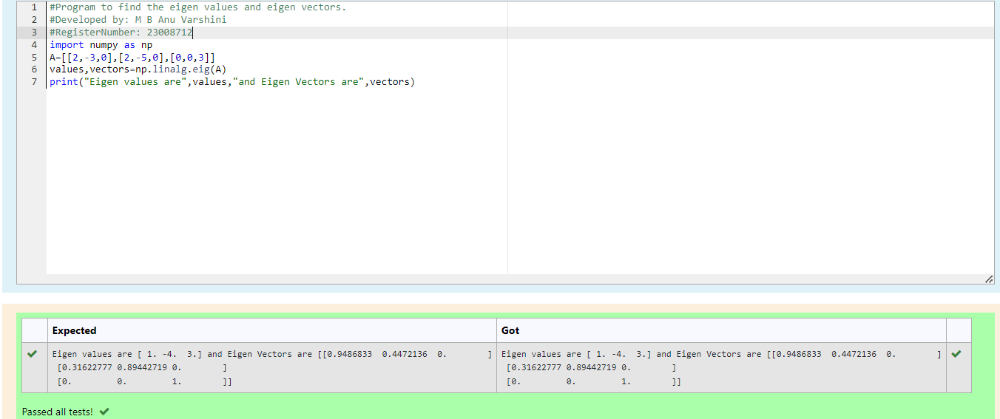

# EIGENVALUES-AND-EIGENVECTORS
## Aim:
To write a python program to find the Eigenvalues and Eigen Vectors
## Equipment’s required:
1. 	Hardware – PCs
2. 	Anaconda – Python 3.7 Installation / Moodle-Code Runner
## Algorithm:
### Step1 :
Import NumPy library as 'np' for numerical computations.
### Step 2: 
Create a 3x3 matrix A with specified values. 
### Step 3: 
Using the np.linalg.eig(),  we get two results (first is eigenvalue and second is eigenvector) of the given matrix.
### Step 4: 
Print the computed eigenvalues and eigenvectors of matrix A.
## Program:
```PYTHON
#Program to find the eigen values and eigen vectors.
#Developed by: M B Anu Varshini
#RegisterNumber: 23008712
import numpy as np
A=[[2,-3,0],[2,-5,0],[0,0,3]]
values,vectors=np.linalg.eig(A)
print("Eigen values are",values,"and Eigen Vectors are",vectors)
```

## Output:

## Result:
Thus the Eigenvalue and Eigenvector is successfully solved using python program
